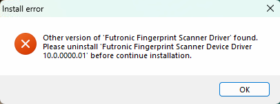
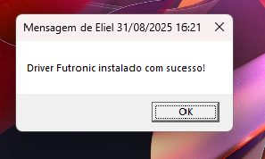

# 🛠️ Futronic_Error_Driver

## 1. 📋 Informações Gerais

- **📅 Data:** 2025-08-19
- **💻 Sistema Operacional:** Windows
- **🖱️ Driver:** Futronic Fingerprint Scanner Driver (versão 10.0.0000.01 instalada)
- **🌐 Fonte de download:** [Futronic Tech](https://futronic-tech.com)

---

## 2. ⚠️ Descrição do Problema

- **❌ Erro Encontrado:**  
  Install error: Other version of 'Futronic Fingerprint Scanner Driver' found. Please uninstall 'Futronic Fingerprint Scanner Device Driver 10.0.0000.01' before continue installation.

- **📌 Contexto:**  
  O erro ocorre ao tentar instalar/atualizar uma nova versão do driver para o leitor de impressão digital Futronic. A instalação é interrompida.

- **💥 Impacto:**  
  O driver não pode ser instalado, impedindo a atualização do software do dispositivo e seu funcionamento correto.

---

## 3. 🔍 Diagnóstico

1. **✅ Verificação de Compatibilidade**

   - Conferir se a versão do driver é compatível com o sistema operacional.

2. **🔎 Checagem do erro**

   - Verificar se o Windows está devidamente atualizado.
   - Verificar se já há algum driver do Futronic instalado através do painel de controle.
   - Verificar se há alguma pasta em Arquivos de Programas relacionada ao Futronic.

3. **🛑 Identificando o erro**

   - Mesmo após as verificações acima, o erro ainda é gerado.

   

---

## 4. 🛠️ Passos para Correção Manual

1. **📝 Apagando registro manualmente**

   ```bash
   # Abra o terminal como administrador e execute o editor de registro

   regedit

   # Navegue pelo caminho: \HKEY_LOCAL_MACHINE\SOFTWARE\WOW6432Node

   Identifique e apague a pasta: FutronicDrv

   # Reinicie o computador e tente instalar novamente.

   ```

2. **⬇️ Baixe a versão mais atual do site**
   - [🌐 Site Oficial](https://futronic-tech.com/download.php)
   - [💾 Download do Driver](https://futronic-tech.com/futronic/attachment/upload/futronic/download/ftrDriverSetup_win8_whql_3471.zip)
3. **⚡Instalando**
   - Após isso realize novamente a instalação do driver.

---

## 🖥️ Passos para Correção Automática

Coreção do erro através do **PowerShell com privilégios de administrador**.

### 🚀 Instruções para Execução

### 1. Abrir o PowerShell como Administrador

1. No menu **Iniciar** do Windows, pesquise por **PowerShell**.
2. Clique com o botão direito no ícone do **Windows PowerShell** e selecione **Executar como administrador**.
3. Confirme a permissão no **Controle de Conta de Usuário (UAC)**.

---

### 2. Executar o Comando

No PowerShell aberto como administrador, copie e cole o comando abaixo e pressione **Enter**:

```powershell
powershell -Command "Invoke-WebRequest -Uri 'https://github.com/Eliel-DM/futronic_error_driver/raw/main/src/index.bat' -OutFile 'index.bat'; Start-Process 'index.bat' -Verb RunAs"
```

- 👌Após reiniciar será gerado uma mensagem de sucesso !!

  

**Manual criado por:** Eliel Dias Matos – Analista de Suporte Computacional 👨‍💻
